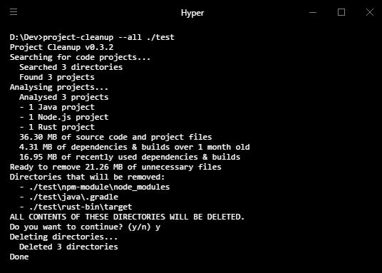

# Project Cleanup
This little tool will recursively browse a directory to find code projects in
several languages. If the project hasn't been touched for more than a month,
it will remove directories containing libraries, dependencies, builds, etc.

The reasoning behind this is that these files can be retrieved or re-generated
at any time, but if you haven't worked on the project for a month chances are
you don't need them taking up space on your hard drive right now.

I'm still learning Rust so this project is nowhere near 'complete', or even
'decent'. I have done and am doing my best to write good code, but a lot of it
is still a work in progress.

## Install
- Make sure you have installed Rust Nightly
- Clone the repo and build the application with `cargo build`

## How it works
Run the application with `project-cleanup --help` to see the options.

## Supported languages
- Node.js (will remove the `node_modules` and `.cache` directories)
- Rust (will remove the `target` directory)
- Java (will remove the `.gradle` and `build` directories)

These languages are based on my own experience and use patterns. I welcome
issues and pull requests to add more languages and/or more unnecessary
directories in already added languages.

## License
The application is published under the MIT license.
