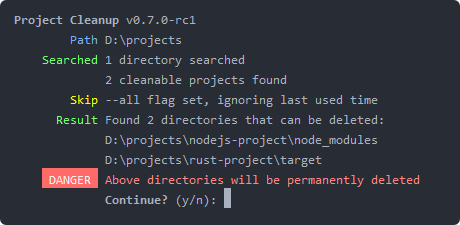

|

This little tool will recursively browse a directory to find code
projects in several languages. If the project hasn't been touched for
more than a month, it will remove directories containing libraries,
dependencies, builds, etc.

The reasoning behind this is that these files can be retrieved or
re-generated at any time, but if you haven't worked on the project for
a month chances are you don't need them taking up space on your hard
drive right now.

## Install
Download the binary for your platform from the
[releases page](https://github.com/woubuc/project-cleanup/releases)

Or install via Cargo: `cargo install project-cleanup`

## How it works
Run the application with `project-cleanup --help` to see the options.

## Supported languages
- Node.js (will remove the `node_modules` and `.cache` directories)
- Rust (will remove the `target` directory)
- Java (will remove the `.gradle` and `build` directories)

These languages are based on my own experience and use patterns.

### Adding more languages
Add the necessary checks in
[src/discover_projects/detect_cleanable_project.rs](https://github.com/woubuc/project-cleanup/blob/master/src/discover_projects/detect_cleanable_project.rs)
and submit a pull request to add more built-in languages, or to add
more unnecessary directories to existing languages.

## License
Everything in this repository is published under the MIT license. See
the LICENSE file for more information.
